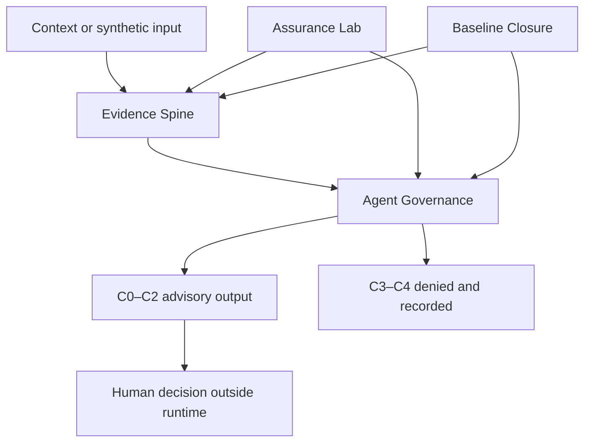

# TruncAI-OTiX Public Architecture

> Status: **PUBLISHED WITH OWNER APPROVAL**
>
> Disclosure level: **D0 · PUBLIC**
>
> Baseline: **V2.1**
>
> Publication date: **2026-09-07**

This is a deliberately high-level architecture view. It explains evidence flow and authority boundaries without exposing source code, exact schemas, security rules, test fixtures or proprietary implementation detail.

## Component roles

| Component | Public role description | Deliberately withheld at D0 |
|---|---|---|
| Evidence Spine | Maintains versioned, integrity-linked records that support traceability and replay within the tested scope. | Exact contracts, schemas, canonicalization rules, event fields and storage implementation. |
| Agent Governance | Applies identity, ownership, purpose, tool, privilege, validity, budget, revocation and human-in-the-loop constraints. | Policy code, enforcement details, rule ordering and security configuration. |
| Assurance Lab | Exercises deterministic synthetic scenarios, including negative testing and a virtual-case campaign. | Fixtures, payloads, generators, detailed procedures and executable harnesses. |
| Baseline Closure | Checks that the declared baseline closes consistently and fails closed against silent authority or claim expansion. | Machine-readable closure rules, internal manifests and pipeline implementation. |

## Capability boundary

| Level | Meaning | V2.1 position |
|---|---|---|
| C0 | Observe | Permitted within the tested scope. |
| C1 | Analyze | Permitted within the tested scope. |
| C2 | Recommend | Maximum permitted authority. |
| C3 | Prepare or issue an action | Prohibited in the tested V2.1 object. |
| C4 | Execute or control | Prohibited in the tested V2.1 object. |

The C2 ceiling is a scoped internal design and test statement. It is not a claim that every future integration, deployment or modification will preserve the same boundary.

## Trust and operational boundary

- V2.1 is local, synthetic and non-operational.
- The evaluated object has no network access and no operational protocol integration.
- The controlled credential inventory is reported as empty for V2.1.
- Real operational data is outside this baseline.
- Human decisions occur outside the advisory runtime.
- Real-world continuity and real human-review evidence remain inconclusive.

## What this diagram does not prove

This view does not independently demonstrate execution, security, regulatory conformity, industrial suitability, continuous availability or effective human supervision. Those outcomes would require additional evidence and, where applicable, external validation.
